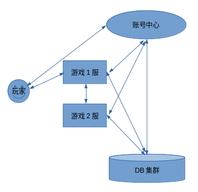
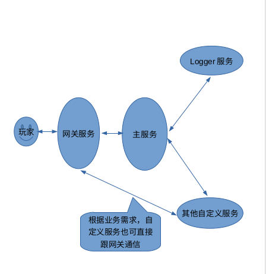

ggApp
=====
ggApp是一个基于[gg](https://github.com/sundream/ggApp/tree/master/gamesrv/src/gg)的游戏服务器示例,
引擎使用[skynet](https://github.com/cloudwu/skynet),上层使用Lua开发。

Table of Contents
=================

* [名字](#ggApp)
* [状态](#状态)
* [特点](#特点)
* [一键部署](#一键部署)
* [服务器](#服务器)
* [客户端](#客户端)
* [压测工具](#压测工具)
* [服务器结构](#服务器结构)
* [目录结构](#目录结构)
* [文档](#文档)
* [社区](#社区)
* [证书](#证书)

状态
===
开发阶段(Make it work)

特点
====
* 对skynet引擎无任何修改
* 易于使用


一键部署
========
使用[ggApp-ansible](https://github.com/sundream/ggApp-ansible)一键部署，他会自动帮我们
安装必要软件,安装依赖,生成db配置文件等.

服务器
======
* 检出
	```
	cd ~ && git clone https://github.com/sundream/ggApp --recursive
	```
* 依赖项
	* 工具/库
	  * ubuntu18.04
		```
		# in ubuntu 16.04,you need change readline-dev to libreadline-dev
		sudo apt install -y protobuf-compiler protobuf-c-compiler readline-dev autoconf git subversion telnet netcat libcurl4-openssl-dev
		```
	  * centos
		```
		sudo yum install -y protobuf-compiler protobuf-c-compiler readline-devel autoconf git subversion telnet nc libcurl-devel
		```
	* [openresty-1.13.6.2](https://openresty.org/en/installation.html)

	* 其他工具(非必要安装)
		* [lua-5.3.5](https://www.lua.org/download.html)
		* python-2.7.15
			```
			curl -R -O https://www.python.org/ftp/python/2.7.15/Python-2.7.15.tgz
			tar -zxvf Python-2.7.15.tgz
			cd Python-2.7.15
			./configure
			make
			sudo make install
			```
		* luarocks for lua5.3
			```
			git clone https://github.com/luarocks/luarocks
			cd luarocks
			./configure --lua-version=5.3 --with-lua-include=/usr/local/include
			make build
			sudo make install
			```

* 安装DB(框架默认使用redis)
	* [安装redis](https://github.com/sundream/ggApp/blob/master/tools/db/redis/README.md)
	* [安装mongodb](https://github.com/sundream/ggApp/blob/master/tools/db/mongodb/README.md)

* 编译accountcenter
	```
	accountcenter是基于openresty实现的,并且没有使用第三方C库,因此
	编译好openresty即可
	```

* 编译gamesrv
	```
	cd ~/ggApp/gamesrv
	make linux
	# make macosx
	```

* 运行accountcenter
	* 首次启动准备工作
		```
		cd ~/ggApp/accountcenter
		mkdir -p logs
		```
	* 启动  
		`openresty -c conf/account.conf -p . &`
	* 关闭  
		`openresty -c conf/account.conf -p . -s stop`
	* 重新加载  
		`openresty -c conf/account.conf -p . -s reload`

* 导入服务器列表
	```
	# 首次启动/服务器配置有变动时执行
	python tools/script/import_servers.py --appid=appid --config=tools/script/servers.dev.config
	```

* 生成服务器配置文件
	```
	# 服务器配置有变动时执行
	python tools/script/generate_gamesrv_config.py --appid=appid --config=tools/script/servers.dev.config --accountcenter=127.0.0.1:8887 --out=~/ggApp/gamesrv/src/app/config
	```

* 运行gamesrv
	* 首次启动准备工作
		```
		cd ~/ggApp
		# gamesrv_1为服务器名
		ln -s gamesrv gamesrv_1
		mkdir -p gamesrv_1/log
		```
	* 直接启动
		```
		cd ~/ggApp/gamesrv_1/skynet
		./skynet ../src/app/config/gamesrv_1.config
		// 启动后成功后控制台会提示start,另外log/game/game$DATE.log会记录启服/关服日志
		// 你也可以在控制台中执行任何lua代码
		```

	* shell管理
		```
		cd ~/ggApp/gamesrv_1/shell
		sh status.sh	# 查看状态
		sh start.sh		# 启动
		sh stop.sh		# 关闭
		sh restart.sh	# 重启
		sh kill.sh		# 强制关闭
		```

	* 执行gm指令
		```
		cd ~/ggApp/gamesrv_1/shell
		sh gm.sh #提示用法
		sh gm.sh 0 help help
		sh gm.sh 0 exec 'print(\"hello\")'
		curl 'http://127.0.0.1:18888/call/8 "gm","0 exec print(\"hello\")"'
		```


[Back to TOC](#table-of-contents)

客户端
======
see [client/README.md](https://github.com/sundream/ggApp/blob/master/client/README.md)

[Back to TOC](#table-of-contents)

压测工具
========
see [robot/README.md](https://github.com/sundream/ggApp/blob/master/robot/README.md)

[Back to TOC](#table-of-contents)

服务器结构
==========
* 节点结构  

	```
	账号中心: 负责账密验证，充值回调验证等
	游戏服: 负责游戏玩法逻辑(根据不同需求可划分成不同功能服)
	DB集群: 默认采用redis集群(你也可以选择使用mongo集群)
	```
* 内部结构  

	```
	说明: 这里的结构并不包括skynet本身启动的服务
	网关服务: 管理客户端连接,协议编码,协议加解密等。目前支持tcp,kcp,websocket网关,可选择使用/混合使用
	主服务: 负责游戏主要玩法逻辑,我们推荐大部分玩法在主服务实现,特定玩法可自定义服务实现
	Logger服务: 日志处理
	```

[Back to TOC](#table-of-contents)

目录结构
========
* 大致目录结构
```
+~/ggApp
	+accountcenter				// 账号中心
	+gamesrv					// 游戏服
		+src
			+gg					// 基础代码
			+app				// 游戏逻辑
			+proto				// 协议
		+shell					// 启服/关服等脚本
	+client						// 简易客户端(如可用来给服务器发送协议,快速登录等)
	+robot						// 压测工具
	+tools						// 其他工具
		+script					// 部分管理脚本
+~/db							// db(包含示例配置)
	+redis					// redis集群
	+mongodb				// mongo集群
```

[Back to TOC](#table-of-contents)

文档
====
* 生成文档
	```
	如果没有安装ldoc,可用以下指令安装
	sudo luarocks install ldoc
	目前gg和accountcenter进行了文档注释,可以用ldoc工具导出html文档,如:
	cd accountcenter
	ldoc .
	执行后将会生成doc目录,用浏览器打开doc/index.html即可查看文档
	```
* 查看[Wiki](https://github.com/sundream/ggApp/wiki)来了解更多细节

[Back to TOC](#table-of-contents)


社区
====

[Back to TOC](#table-of-contents)


证书
====
ggApp is licensed under the MIT License,Version 0.0.1. See [LICENSE](https://github.com/sundream/ggApp/blob/master/LICENSE) for the full license text.

[Back to TOC](#table-of-contents)
